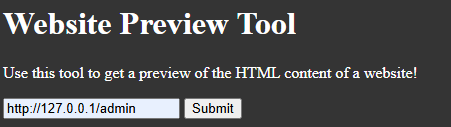
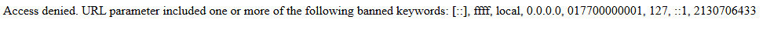

# 題目敘述


簡單講就是他說答案在 local 端的 5000 port 下的 admin

# 解題

網頁打開下圖有一個輸入欄位，這邊嘗試輸入 127.0.0.1:5000/admin



下圖是按下 submit 會看到出錯，可以看到他有對一些字串做過濾，所以就是要繞過而已



這就是標準的 SSRF 

SSRF 是一種漏洞，攻擊者可以誘使伺服器去發送請求，目標是原本使用者無法直接存取的資源

這邊的錯誤顯示他有阻擋：
```
[::], ffff, local, 0.0.0.0, 017700000001, 127, ::1, 2130706433
```

所以要想繞過的方式

底下是我的方式可以繞過拿到答案

```
# 16 進制表示
http://0x7f000001:5000/admin

# 8 進制表示
http://0177.1:5000/admin

```
